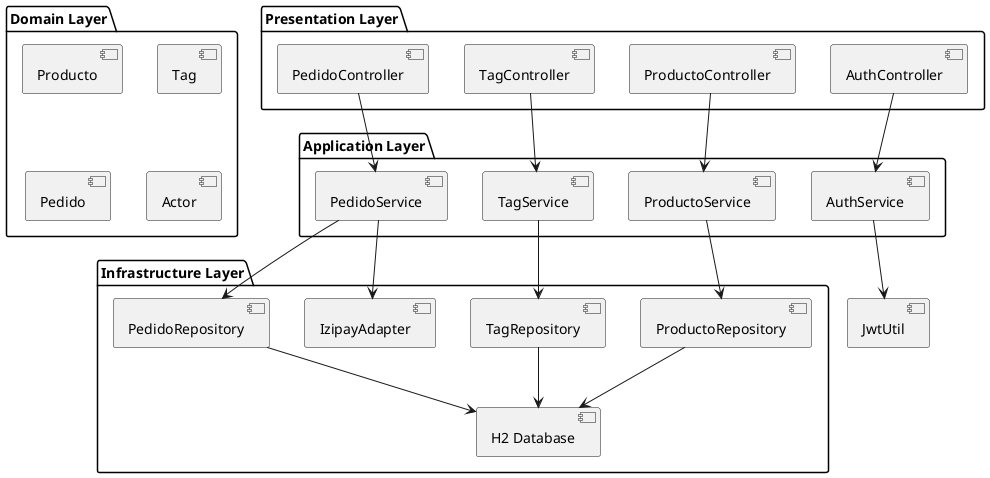
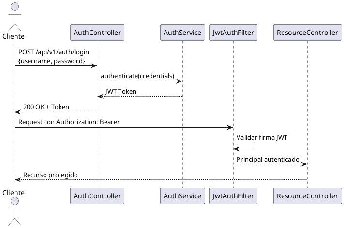
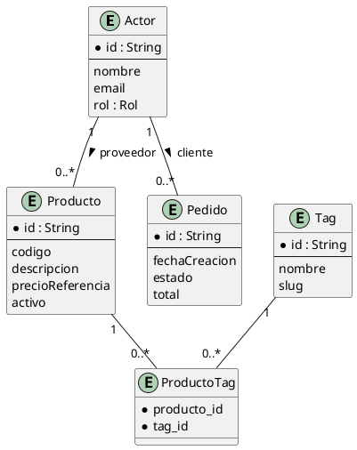

# MercadoLink B2B - Arquitectura del Sistema

## Visión General

MercadoLink B2B es una plataforma de comercio electrónico B2B diseñada para facilitar las transacciones entre proveedores mayoristas y clientes corporativos. El sistema implementa una arquitectura orientada a servicios (SOA) con una capa de API REST expuesta mediante OpenAPI/Swagger.

## Arquitectura por Capas

El sistema está estructurado en capas bien definidas siguiendo principios de separación de responsabilidades:

- **Capa de Presentación**: Controllers REST (`@RestController`) que exponen endpoints bajo `/api/v1/`
- **Capa de Aplicación**: Services que encapsulan la lógica de negocio
- **Capa de Dominio**: Entidades JPA que modelan el negocio
- **Capa de Infraestructura**: Repositories, configuraciones y adaptadores externos

## Modelo de Dominio Principal

### Actores del Sistema

El sistema maneja tres roles principales:
- **PROVEEDOR**: Vende productos y gestiona su catálogo
- **ADMINISTRADOR**: Administra el sistema completo
- **CLIENTE**: Usuario autenticado que compra productos (implícito)

### Entidades Clave

| Entidad | Descripción |
|---------|-------------|
| `Producto` | Artículos ofertados por proveedores con código, descripción y precio de referencia |
| `Tag` | Etiquetas categorizadas para productos con soporte de slug y conteo |
| `ProductoTag` | Relación many-to-many entre productos y etiquetas |
| `Pedido` | Órdenes de compra con gestión de estados |
| `Actor` | Usuarios del sistema con roles y datos de autenticación |

## Integraciones Externas

### Izipay (Pasarela de Pagos)

El sistema integra Izipay como pasarela de pagos para procesar transacciones. Los webhpook controllers (`IzipayWebhookController`) reciben notificaciones de pago y actualizan el estado de las transacciones.

### Seguridad JWT

La autenticación se basa en tokens JWT con el flujo:
1. Login en `/api/v1/auth/login`
2. Emisión de token firmado con clave secreta
3. Validación en cada request mediante `JwtAuthFilter`
4. Autorización basada en roles con `@PreAuthorize`

## Principios SOA Aplicados

- **Service Contracts**: Cada service expone interfaces bien definidas
- **Service Loose Coupling**: Inyección de dependencias mediante Spring
- **Service Reusability**: Services pueden ser reutilizados entre controllers
- **Service Abstraction**: Lógica de negocio oculta tras APIs REST documentadas

---

# Documentación API y Protocolos SOA

## Especificación OpenAPI

La API está documentada automáticamente con SpringDoc OpenAPI 2.6.0, accesible en `/swagger-ui.html`. La configuración en `OpenApiConfig.java` define:

```java
@Bean
public OpenAPI mercadolinkOpenAPI() {
    return new OpenAPI()
            .info(new Info()
                    .title("MercadoLink B2B API")
                    .version("1.0.0")
                    .description("API REST del sistema MercadoLink/Aspropa (proyecto SOA)..."))
            .addSecurityItem(new SecurityRequirement().addList("bearerAuth"))
            .components(new Components().addSecuritySchemes("bearerAuth",
                    new SecurityScheme()
                            .type(SecurityScheme.Type.HTTP)
                            .scheme("bearer")
                            .bearerFormat("JWT")));
}
```

## Protocolo de Comunicación

### REST con JSON

Todos los endpoints siguen el protocolo:
- **Content-Type**: `application/json`
- **Autenticación**: Bearer Token JWT en header `Authorization`
- **Versionado**: `/api/v1/` prefix
- **Códigos HTTP**: 200 (OK), 201 (Created), 400 (Bad Request), 401 (Unauthorized), 403 (Forbidden), 404 (Not Found), 500 (Error)

### Respuestas de Error Estándar

```java
public class ApiError {
    private String codigo;
    private String mensaje;
    private int status;
    private LocalDateTime timestamp;
}
```

## Diagramas PlantUML

### Arquitectura por Capas



### Flujo de Autenticación



### Modelo de Dominio



## Endpoints Principales

### Productos

| Método | Endpoint | Descripción | Roles |
|--------|----------|-------------|-------|
| GET | `/api/v1/productos` | Lista productos activos | Público |
| POST | `/api/v1/productos` | Crea producto | PROVEEDOR, ADMIN |
| PATCH | `/api/v1/productos/{id}/etiquetas` | Actualiza etiquetas | PROVEEDOR, ADMIN |

### Etiquetas

| Método | Endpoint | Descripción | Roles |
|--------|----------|-------------|-------|
| GET | `/api/v1/etiquetas` | Lista etiquetas con conteo | Público |
| GET | `/api/v1/etiquetas/populares` | Etiquetas más usadas | Público |
| POST | `/api/v1/etiquetas` | Crea etiqueta | PROVEEDOR, ADMIN |

## Ejemplo de Request/Response

### Request de Creación de Producto

```bash
curl -X POST http://localhost:8080/api/v1/productos \
  -H "Authorization: Bearer $TOKEN" \
  -H "Content-Type: application/json" \
  -d '{
    "codigo": "PROD-001",
    "descripcion": "Producto de ejemplo",
    "precioReferencia": 100.00,
    "etiquetas": "tag1,tag2"
  }'
```

### Response Estándar

```json
{
  "id": "uuid-producto",
  "codigo": "PROD-001",
  "descripcion": "Producto de ejemplo",
  "unidadMedida": "UNIDAD",
  "precioReferencia": 100.00,
  "activo": true,
  "etiquetas": ["tag1", "tag2"],
  "proveedor": "Nombre Comercial"
}
```